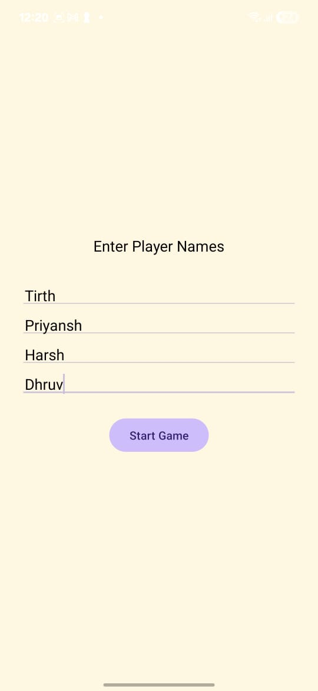
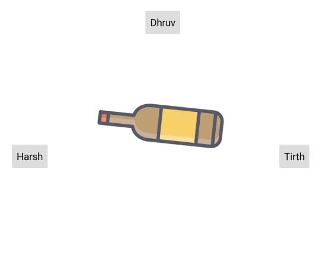

# 🎉 Truth and Dare - Spinning Bottle Game

A **Truth and Dare** game for Android using **Java** and **XML** in **Android Studio**. The game features a spinning bottle animation that randomly selects a player when tapped.

## 🚀 Features
- 🎡 **Fast Bottle Spin** – Spins quickly in **1.5 seconds**.
- 🔄 **Smooth Animation** – Uses `RotateAnimation` for fluid movement.
- 🔊 **Sound Effects** – Plays a spin sound when the bottle rotates.
- 🎯 **Random Player Selection** – Chooses between **Player 1 to Player 4**.
- 📱 **Edge-to-Edge UI** – Modern Android UI with **EdgeToEdge** mode.

## 🎮 How It Works
1. Enter the No of Players.
2. Then Enter the Names of the Player
3. Now spin the the Bottle.
4. There are Options to select the Truth, Dare, Never Have I ever.
   
## 🛠️ Tech Stack
- **Java** – Android development.
- **XML** – UI design.
- **MediaPlayer** – For playing sound effects.
- **RotateAnimation** – For smooth bottle rotation.
- **API** - https://docs.truthordarebot.xyz


<table style="width:100%; border-collapse:collapse;">
  <tr>
    <td style="width:25%; padding:4px;">
      
    </td>
    <td style="width:25%; padding:4px;">
      
    </td>
    <td style="width:25%; padding:4px;">
      
    </td>
    <td style="width:25%; padding:4px;">
      
    </td>
  </tr>
</table>


## ⚙️ Setup & Installation
1. Clone this repository:
   ```sh
   git clone https://github.com/TirthChapla/truthNdare


